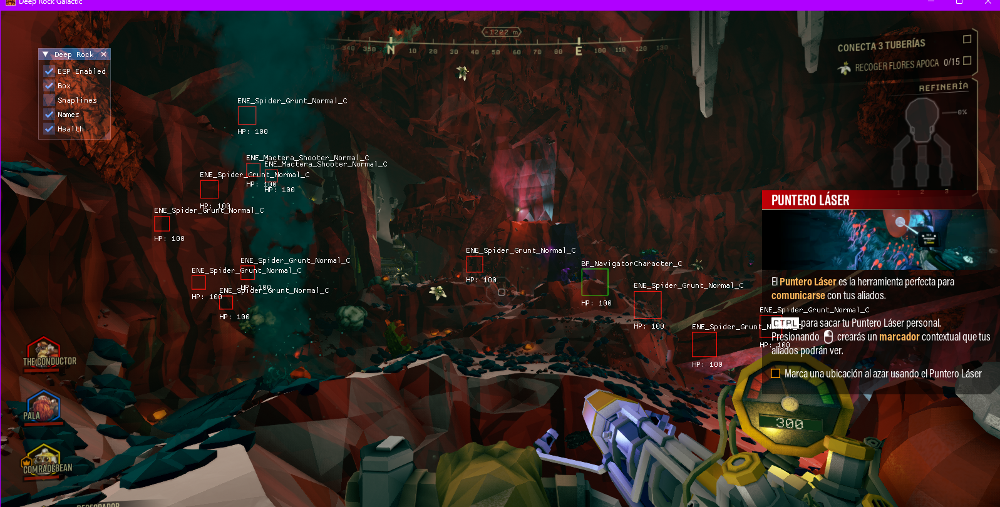

# Mi Primer Proyecto - Deep Rock Galactic External ESP

Este es mi primer proyecto.

Soy consciente de que su utilidad práctica puede ser limitada, pero lo he creado con el único propósito de **aprender** y mejorar mis habilidades de programación. Es un paso importante en mi proceso de aprendizaje. ¡Gracias por verlo!

## Descripción
Lo he publicado para que puedan probarlo si alguien está en mi mismo punto actual de aprendizaje. He dejado que la consola muestre lo que hace el programa para que se sientan un poco más en confianza de probarlo.

**Nota de Seguridad:** No es ningún virus. Windows Defender puede detectarlo como tal debido a la protección **VMProtect** que le he agregado para proteger el código.

Cualquier desconfianza siempre podrán contactarme en mi Discord: **redwoody22**.

Este *external cheat* es totalmente confiable ya que Deep Rock Galactic no tiene ningún tipo de protección kernel contra cheats. Además, al ser externo, no funciona mediante inyección DLL, solo lee la memoria del juego.

## Requisitos e Instrucciones

Para que el programa funcione correctamente, asegúrate de cumplir lo siguiente:

1.  **Juego:** Deep Rock Galactic (Versión Steam).
    *   **IMPORTANTE:** Debes abrir el juego seleccionando **DirectX 11** en el lanzamiento.
2.  **Modo de Pantalla:** Debes configurar el juego en **"Ventana sin Bordes" (Borderless Window)** o **"Ventana"**.
    *   *En Pantalla Completa exclusiva el menú podría no visualizarse correctamente.*
3.  **Resolución:** El programa detecta automáticamente la resolución de la ventana del juego, pero se recomienda **1600x900** para una experiencia óptima (que es la que uso yo).
4.  **Ejecución:**
    *   Abre el juego primero y entra al lobby (Space Rig).
    *   Ejecuta el `FSDTrainer.exe` como Administrador.

## Vista Previa

### Selección de Inicio (DirectX 11)

